# 🛒 Django E-commerce Web Application

## 📌 Project Overview

This is a fully functional E-commerce Web Application developed using the Django framework (Python).  
The application allows users to browse products, register/login, add items to cart, manage wishlist, and place orders.

This project demonstrates backend development, database management, authentication system, and frontend integration using Django.

---

## 🚀 Key Features

### 👤 User Features
- User Registration & Login
- Secure Authentication System
- Product Browsing
- Product Detail View
- Add to Cart
- Wishlist Management
- Search Functionality
- Order Placement
- Profile & Address Management

### 🛠 Admin Features
- Django Admin Panel
- Product Management (Add / Update / Delete)
- Order Management
- Customer Data Management

---

## 🏗️ Project Architecture

- Django MVT Architecture
- Models for Database Structure
- Views for Business Logic
- Templates for Frontend Rendering
- Static Files Management
- Media File Handling

---

## 🛠 Tech Stack

### Backend:
- Python
- Django Framework

### Frontend:
- HTML5
- CSS3
- Bootstrap
- JavaScript

### Database:
- SQLite (Development)

---

## 📁 Folder Structure

Ecomm/
│
├── ec/
│   ├── app/
│   │   ├── models.py
│   │   ├── views.py
│   │   ├── urls.py
│   │   ├── templates/
│   │   └── static/
│   ├── settings.py
│   ├── urls.py
│   └── wsgi.py
│
├── manage.py
├── requirements.txt
└── README.md

---

## 📸 Project Screenshots

### 🏠 Home Page

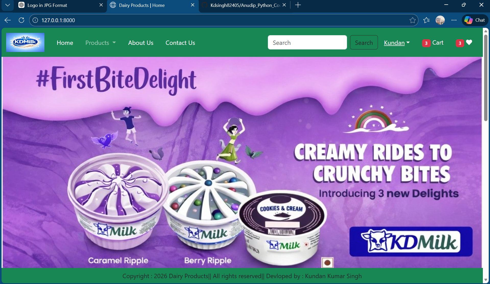

### Address

### 🛍 Products Page
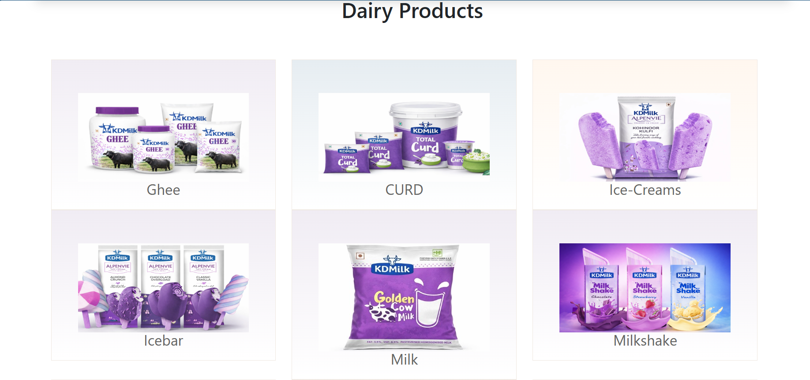

### 🛒 Cart Page
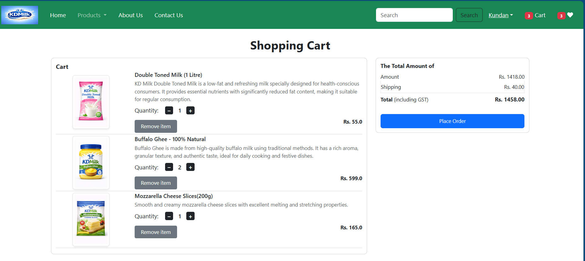

### ❤️ Wishlist
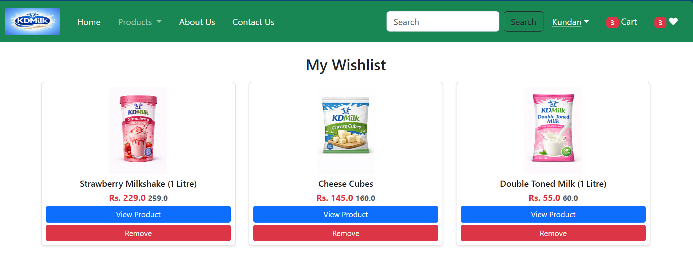

### 👤 Profile Section
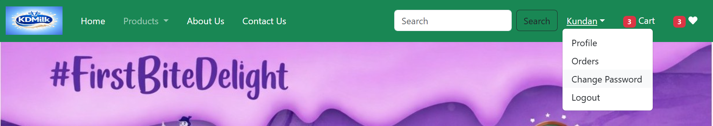

### Password
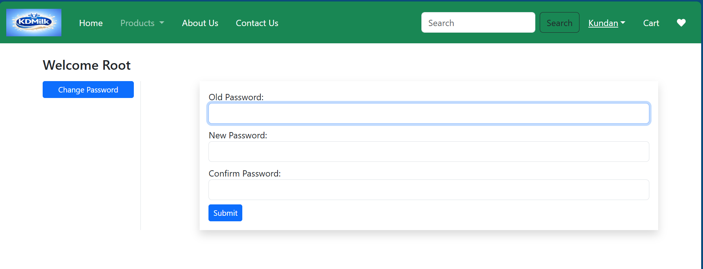

### 📦 Orders Section
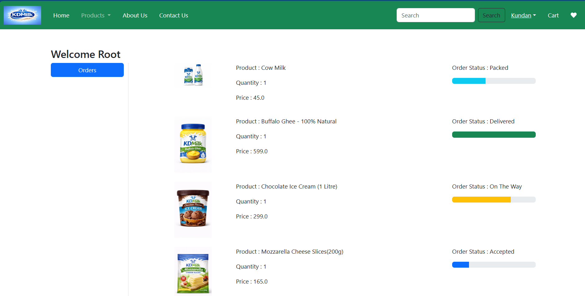
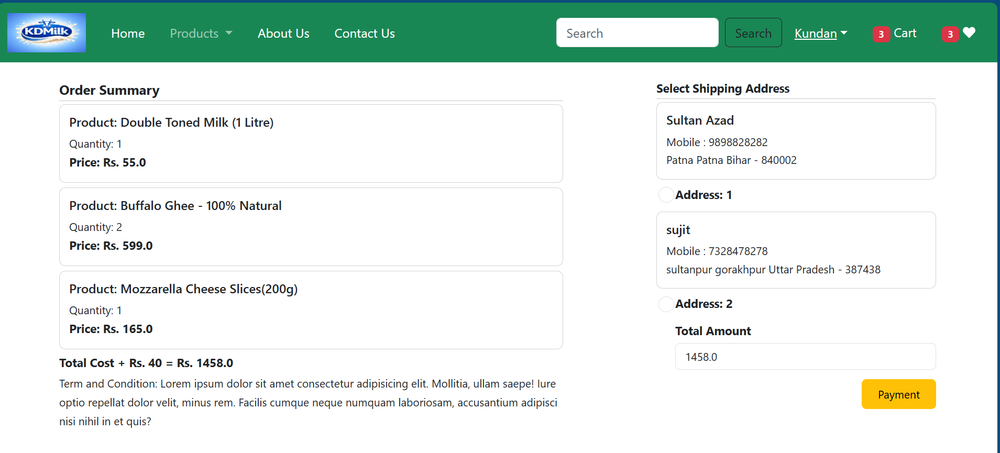

### 💳 Payment Page
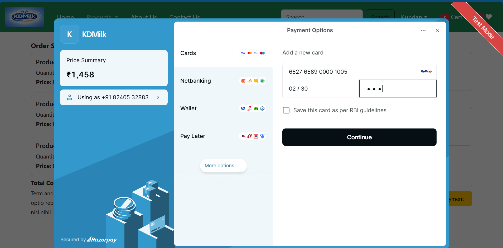
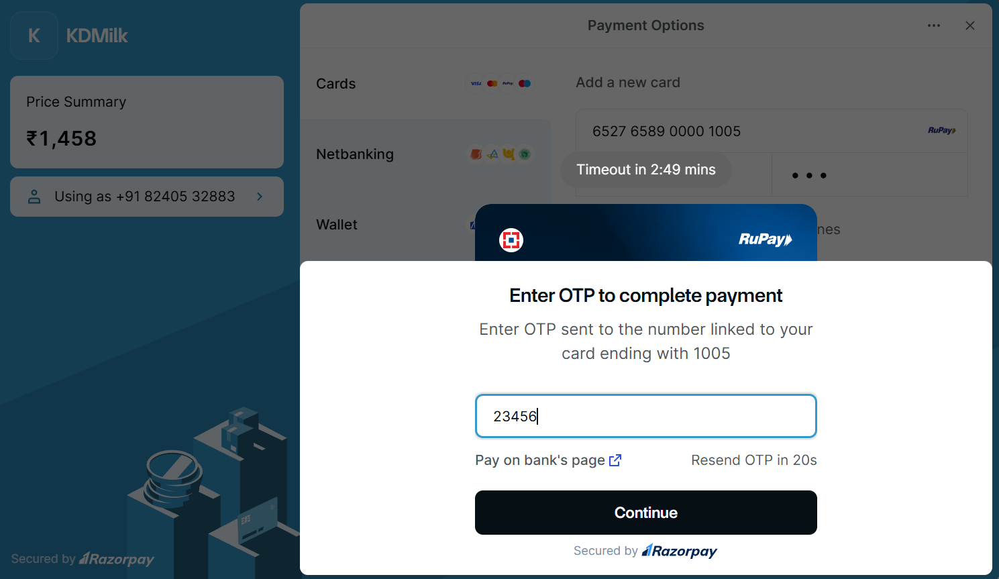

### ✅ Payment Success
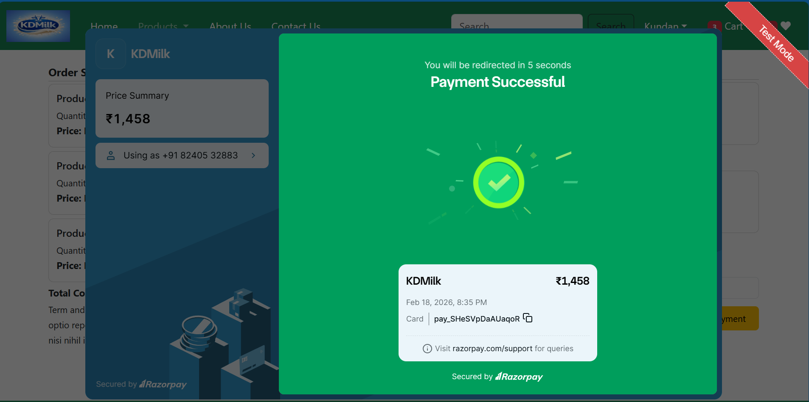

---

## ⚙️ Installation & Setup Guide

### 1️⃣ Clone Repository

git clone https://github.com/Kdsingh82405/Anudip_Python_Course.git

### 2️⃣ Navigate to Project Folder

cd Ecomm

### 3️⃣ Create Virtual Environment

python -m venv env

### 4️⃣ Activate Virtual Environment (Windows)

env\Scripts\activate

### 5️⃣ Install Dependencies

pip install -r requirements.txt

### 6️⃣ Run Migrations

python manage.py migrate

### 7️⃣ Run Development Server

python manage.py runserver

Open browser:
http://127.0.0.1:8000/

---

## 🔐 Admin Panel Access

Create superuser:

python manage.py createsuperuser

Access admin panel:

http://127.0.0.1:8000/admin

---

## 🎯 Skills Demonstrated

- Django Models & ORM
- Authentication System
- CRUD Operations
- Template Rendering
- Static & Media Management
- Git & GitHub Version Control
- MVC Architecture Implementation

---

## 🔮 Future Improvements

- Payment Gateway Integration
- Product Filtering & Sorting
- Email Notifications
- REST API Integration
- Deployment on Cloud Platform

---

## 👨‍💻 Developer

Kundan Kumar Singh  
Python & Django Developer

---

⭐ If you found this project useful, please consider giving it a star.
